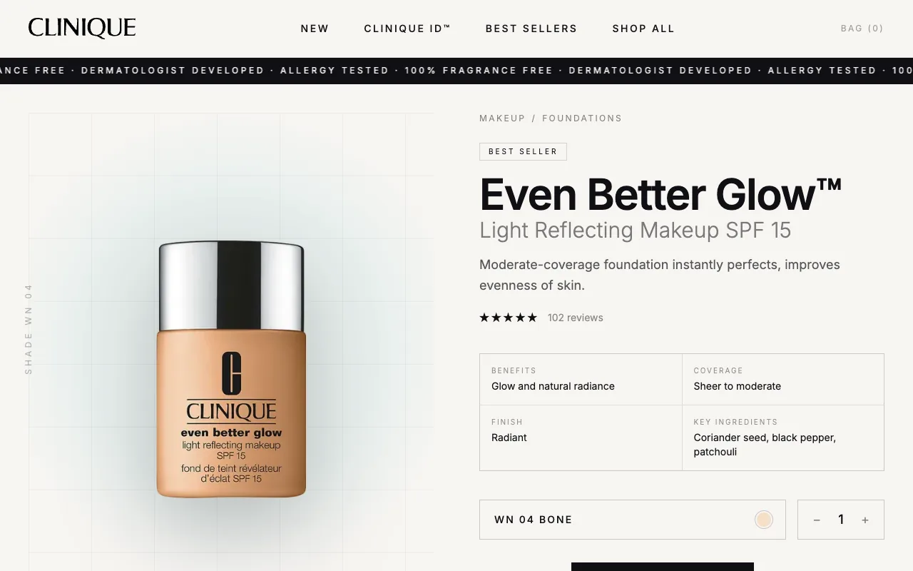

🫙 **bytes**: the apps.

<p align="center">
  
  
  
  
  
  
</p>

<picture><source media="(prefers-color-scheme: dark)" srcset="assets/hero-dark.svg"></picture>

### 🧭 toc

- [trophy-sys](#-trophy-sys) — psn trophies in a dos terminal
- [x-com chat](#-x-com-chat) — chat with alien friends
- [space explorer](#%EF%B8%8F-space-explorer) — a graphql client and its server
- [financial](#-financial) — invoices on one sheet
- [cv](#-cv) — the cover page
- [figmentation](#%EF%B8%8F-figmentation) — figma files, rebuilt in css
- [shared](#-shared) — the kit, the configs, the workbench

## 🎮 trophy-sys

a playstation trophy tracker that looks like a dos terminal: the whole psn library, every
trophy per game and dlc, and what is new since the last look.

[live](https://trophy-sys.vercel.app) | [source](apps/trophy-sys)


## 👽 x-com chat

an ai chat with alien friends, each with its own quirks. a friend's picture shifts as the chat
goes on.

[live](https://x-com-chat.vercel.app) | [source](apps/x-com-chat)


## 🛰️ space explorer

a graphql pair: an apollo client books a seat on the next spacex launch, an apollo server with
prisma answers it.

[live](https://space-explorer-ui.vercel.app) | [api](https://space-explorer-api.up.railway.app/) | [ui source](apps/space-explorer-ui) | [api source](apps/space-explorer-api)


## 🏄 financial

invoicing, kept straight: what was billed, what was paid, what is still owed, on one sheet.

[live](https://financical.vercel.app) | [source](apps/financial)


## 🦦 cv

the cover page: a short brief and the tools in use, grouped by what they do.

[live](https://ripeluokte.vercel.app) | [source](apps/cv)


## ☘️ figmentation

figma files rebuilt in plain css modules. clinique is the first one.

[live](https://figmentation.vercel.app/clinique) | [source](apps/figmentation) | [figma file](https://www.figma.com/design/C83qYEFPJ8C66yIrTjEk29/Clinique?m=auto&t=p08olW2Pvhdsl68U-6)



## 🧰 shared

- [`kit`](packages/kit) — the one design system, shadcn on base ui
- [`biome-config-polished`](packages/biome-config-polished) — lint and format rules for every app
- [`prettier-config-polished`](packages/prettier-config-polished) — the same, for prettier, [on npm](https://www.npmjs.com/package/prettier-config-polished)
- [`typescript-config`](packages/typescript-config) and [`utils`](packages/utils) — the base tsconfigs and small helpers
- [`proto-lab`](apps/proto-lab) — a local vite workbench for prototypes, never deployed

## 🏎️ run it

a pnpm workspace, run by [turborepo](https://turborepo.com).

```bash
pnpm i
pnpm dev:trophy-sys   # or any dev:<app>
pnpm badges:sync      # redraw the badges above
```
