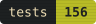
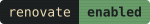
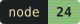
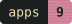
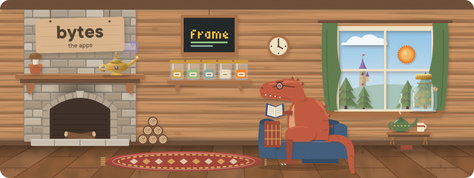
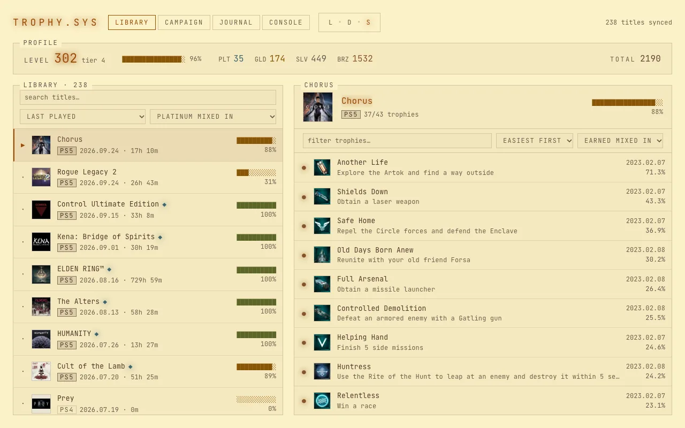
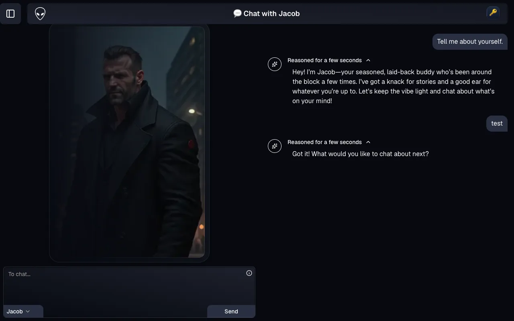
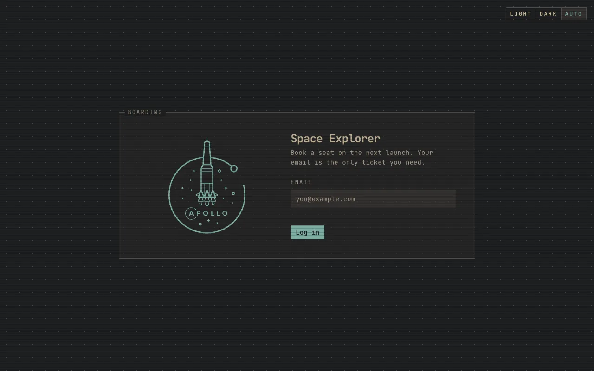
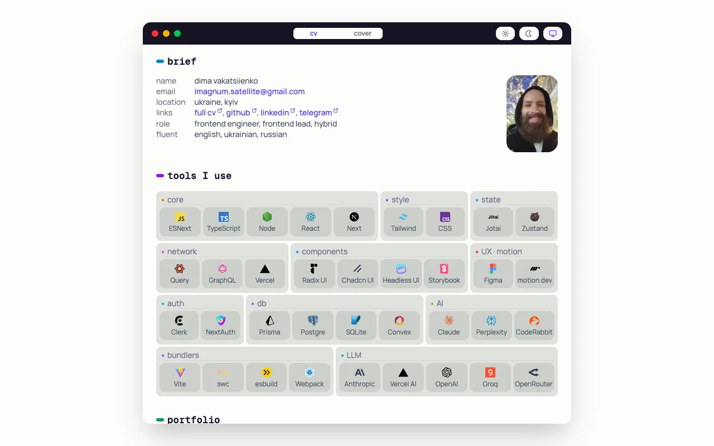
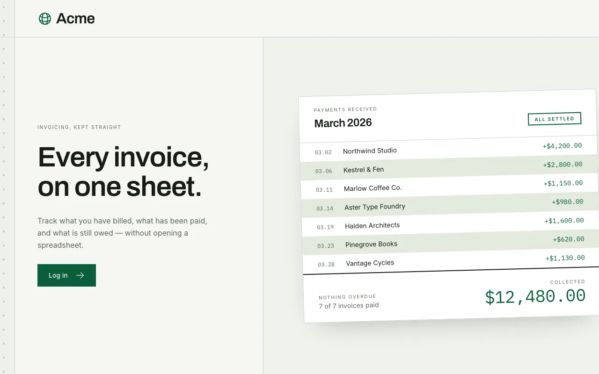

<p align="center">
  <a href="https://github.com/dvakatsiienko/bytes/actions/workflows/ci.yml"></a>
  
  
  
  
  
  
  
</p>

<picture><source media="(prefers-color-scheme: dark)" srcset="assets/hero-dark.svg"></picture>

## 🛸 apps

### 🎮 trophy-sys

<picture><source media="(prefers-color-scheme: dark)" srcset="assets/avatars/trophy-sys-dark.svg"></picture>

a playstation trophy tracker that looks like a dos terminal.

[live](https://trophy-sys.vercel.app) | [source](apps/trophy-sys)

<details><summary>peek</summary></details>

<br clear="all">

### 👽 x-com chat

an ai chat with alien friends, each with its own quirks.

[live](https://x-com-chat.vercel.app) | [source](apps/x-com-chat)

<details><summary>peek</summary></details>

<br clear="all">

### 🛰️ space explorer

a graphql pair: book a seat on the next spacex launch.

[live](https://space-explorer-ui.vercel.app) | [source](apps/space-explorer-ui) | [api](https://space-explorer-api.up.railway.app/) | [api source](apps/space-explorer-api)

<details><summary>peek</summary></details>

<br clear="all">

### 🦦 cv

the cover page: a short brief and the tools in use.

[live](https://ripeluokte.vercel.app) | [source](apps/cv)

<details><summary>peek</summary></details>

<br clear="all">

### 🏄 financial

invoicing, kept straight: billed, paid, still owed.

[live](https://financical.vercel.app) | [source](apps/financial)

<details><summary>peek</summary></details>

<br clear="all">

## 🧰 libraries

- [`biome-config-polished`](packages/biome-config-polished) — the lint and format rules every app extends
- [`prettier-config-polished`](packages/prettier-config-polished) — the prettier rules, [on npm](https://www.npmjs.com/package/prettier-config-polished)

## 🏎️ run it

a pnpm workspace, run by [turborepo](https://turborepo.com).

```bash
pnpm i
pnpm dev:trophy-sys   # or any dev:<app>
pnpm badges:sync      # redraw the badges above
```
